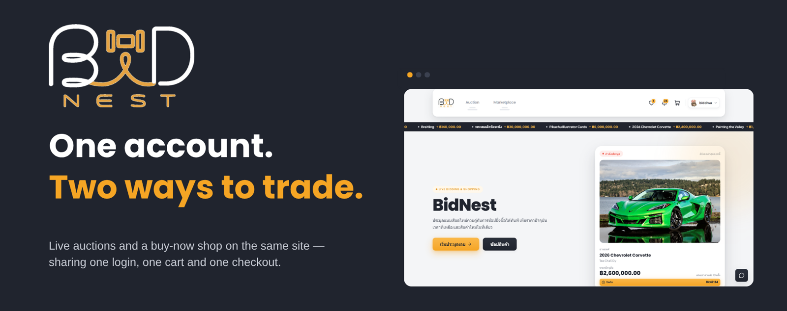

# BidNest — Auction & Marketplace



**One account. Two ways to trade.** Bid on it, or buy it now: same login, same cart, same checkout.

A marketplace with two ways to buy: **real-time auctions** and a **buy-now shop**. Both share one account system, one cart, one checkout and one shipping flow, and any user can buy and sell from the same account.

## Live demo

**<https://bidnest-auction-marketplace.vercel.app>**

- The interface is in **Thai**.
- Anyone can sign up. Every login is confirmed with a one-time code sent by email, so use a real address and check the spam folder if the code doesn't arrive.
- Payments are simulated. No real money is charged.

## Demo videos

Silent screen recordings of the live site.

### Site tour

The home page, live auction ticker, and the auction and shop listings.

https://github.com/user-attachments/assets/780f89b0-7964-440c-a712-0b85b51ad6ad

### Live auction

Two browsers bid on the same auction. Price, leader and the countdown update in both instantly, and a late bid triggers an anti-sniping extension.

https://github.com/user-attachments/assets/534aca8a-1c27-4bdf-a5b0-93747111d037

### Shop and checkout

Browsing products, adding to cart, paying once for several items, viewing orders, and listing a new product.

https://github.com/user-attachments/assets/87de2be8-4b7e-4b7d-97cc-530b3f799679

### AI features and chat

The support chat handing over to an admin, the AI price estimate on an auction draft, and negotiating and chatting with a seller.

https://github.com/user-attachments/assets/c5110fdb-fc29-4144-b2c5-80c5f9f55ef9

### Admin dashboard

Overview, audit log and the support chat queue.

https://github.com/user-attachments/assets/bcc41b22-14af-4573-88b8-a26fe5687cd9

## Features

| Area | What it does |
| --- | --- |
| **Accounts** | Email sign-up, Google and LINE sign-in, two-factor login with an emailed one-time code, trusted devices, password reset |
| **Auctions** | Draft → completeness check → preview → publish. Auctions open and close on schedule, and the home page shows hot, ending-soon, starting-soon and recently-ended auctions |
| **Live bidding** | Real-time bids over WebSocket, a lobby and arena for each auction, a results page, and anti-sniping extensions |
| **Shop** | Product listings with stock, search and filters, one cart across several shops, one payment split into an order per seller, shipment tracking |
| **AI (Google Gemini)** | Starting-price suggestions for auction drafts, price negotiation against a floor the seller sets, and a support chat that hands over to an admin when it can't help |
| **Notifications & chat** | In-app notifications for 8 events (outbid, auction won, order placed, shipment updates and more) and buyer–seller chat tied to a product or auction |
| **Admin** | Suspend users, manage categories, cancel auctions, suspend listings, review orders, take over support chats, and an audit log of every admin action |

**Out of scope for V1:** refunds and cancellations after payment. `SOLD` and `UNSOLD` are final, and payments go through a mock provider rather than a real gateway.

## Engineering highlights

- **Bids can't be lost or doubled.** A bid is checked and written in one database transaction and broadcast only after the commit. Retrying with the same request id returns the original bid instead of placing a second one.
- **Anti-sniping.** A bid in the last 2 minutes pushes the end time out by 2 minutes, up to 5 times, and each extension is recorded.
- **Auctions run on a clock.** A scheduler opens and closes auctions every 10 seconds and settles the winner against the reserve price.
- **Private prices stay on the server.** Reserve prices and negotiation floors never reach buyers. A global response interceptor also strips password and token hashes and owner-only fields from any endpoint that forgets to.
- **Checkout can't oversell.** Prices are recalculated on the server, stock is deducted with a conditional update so two buyers can't both take the last item, and a unique index lets each won auction be paid for only once.
- **Real-time without stale screens.** Socket.IO has a public namespace for auction rooms and an authenticated one for each user. A client treats every event as a signal to refetch, so the screen always shows a consistent state.
- **Admin actions are auditable.** Each admin action writes its audit-log entry, with a reason, in the same transaction as the change itself.
- **The AI can't give away the floor.** The negotiation floor is enforced in code, not left to the prompt.
- **CI on every pull request.** Every PR runs lint, unit tests for both apps, a production build of the web app, a Docker build of the API, and end-to-end tests against real PostgreSQL and a mail server.

## Tech stack

| Part | Tools |
| --- | --- |
| Frontend | Next.js 16 (App Router), React 19, TypeScript, Tailwind CSS 4, shadcn/ui, TanStack Query, React Hook Form + Zod, NextAuth v5 |
| Backend | NestJS 11, TypeScript, Prisma 7, class-validator, Passport + JWT, Throttler, Swagger |
| Database | PostgreSQL 17 |
| Real-time | Socket.IO: `/auctions` (auction rooms) and `/user` (notifications, chat) |
| AI | Google Gemini |
| Services | Cloudinary (images), SMTP / SendGrid (email), Maildev locally |
| Testing | Vitest + Testing Library (web), Jest (API unit), Jest + Supertest (API e2e) |
| Tooling | pnpm 11 workspaces, Node 24, Docker Compose, ESLint, Prettier, Husky + lint-staged, GitHub Actions |
| Hosting | Vercel (web), Railway (API + PostgreSQL) |

## Architecture

The browser never talks to the database or to external services directly. Everything goes through `apps/api`, and real-time updates come from the same API over Socket.IO.

```
apps/
  web/            Next.js app for buyers, sellers and admins
  api/            NestJS API, where all business rules live
    prisma/       schema, migrations and seed data
    test/         e2e specs, .http request files, Postman collection
packages/
  config/         shared configuration
  contracts/      types shared by web and api
infra/docker/     local PostgreSQL + Maildev
docs/             requirements, architecture decisions, diagrams, team guides
Dockerfile        production image for apps/api
```

- **How it works:** the [workflow diagrams](docs/architecture/workflows/) cover the system and each feature, drawn from the actual code.
- **Database:** the [ERD](https://dbdiagram.io/d/BidNest-6a803e3ee093539a9ebf8fff) shows the schema.

## Documentation

| Document | What's in it |
| --- | --- |
| [Setup guide](docs/KICKOFF_GUIDE.md#set-up-your-machine--first-time-only) | Running the project locally: prerequisites, environment files, database, seed data |
| [API testing guide](apps/api/test/http/README.md) | Test accounts, `.http` and Postman requests, and how to run the unit and e2e tests |
| [Release guide](docs/RELEASE_GUIDE.md) | How changes reach production through a `dev` → `main` release PR |
| [Handbook](docs/BIDNEST_HANDBOOK-en.html) ([Thai](docs/BIDNEST_HANDBOOK.html)) | The full project guide: setup, daily work, how the features connect, testing, why the stack was chosen, production |
| [Workflow diagrams](docs/architecture/workflows/) | System overview and 13 per-feature diagrams |
| [Requirements (SRS)](docs/requirements/) | Every requirement with its acceptance criteria |
| [Architecture decisions](docs/architecture/adr/) | ADRs and their reasoning |
| [ERD source](docs/architecture/erd/bidnest-erd-v1.dbml) | Database schema in DBML |

The handbook and the workflow diagrams are standalone HTML pages. GitHub shows their source, so clone the repo and open them in a browser.

## Team

| Member | Role | Owned |
| --- | --- | --- |
| Dev 1 | Frontend & UI | Design system, layout, shared components |
| Dev 2 | Backend core & security | Authentication, user profiles, categories, database schema and migrations |
| Dev 3 | E-commerce | Products, cart and checkout, orders, shipping, buyer–seller chat |
| Dev 4 | Auction & real-time | Auctions, bidding, live rooms, watchlist, auction notifications |
| Dev 5 | AI & admin | Support chat, price estimator, negotiator, admin dashboard |

### Working on the codebase

- **Branches:** `feat/<module>-dev<n>`, with pull requests into `dev` (never straight into `main`).
- **Commits:** `<type>(<requirement-id>): short description`, e.g. `feat(AUTH-001): add local registration endpoint`.
- **Further reading:** [Kickoff Guide](docs/KICKOFF_GUIDE.md) for setup and conventions, [Daily Workflow](docs/DAILY_WORKFLOW.md) for the day-to-day commands, and [CLAUDE.md](CLAUDE.md) for the team's working rules.
