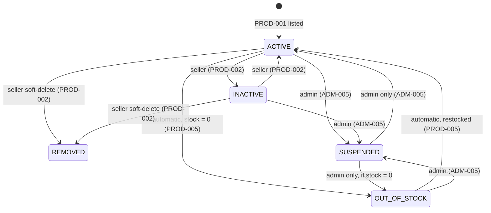

# ADR-0002 — Use a `SUSPENDED` status to separate suspension by an Admin from pausing by the seller

- **Status:** Accepted
- **Date:** 2026-08-19
- **References:** SRS v4 ADM-005, PROD-002, PROD-003, PROD-005
- **Concerns:** Dev 3 (ADM-005, PROD-002, PROD-003, PROD-005), Dev 2 (schema/migration owner)
- **Follows from:** [ADR-0001](0001-single-admin-role-and-shared-category-set.md), the issues-split-off section

---

## Context

The SRS has 2 overlapping requirements:

- **ADM-005** — "The Admin can suspend or reactivate inappropriate product listings, recording a reason every time ... suspension blocks new orders but does not cancel orders that are already paid (PAID)"
- **PROD-002** — "The seller can edit the price, details, images, category and stock while the product is ACTIVE or INACTIVE"

The original `ProductStatus` had `ACTIVE / INACTIVE / OUT_OF_STOCK / REMOVED`, which **can't tell whether an `INACTIVE` came from the seller pausing it or from an admin suspending it**. As a result, the seller could set it back to `ACTIVE` immediately after an admin suspended it, leaving ADM-005 with no real force

The SRS doesn't specify a solution, so the team decided that **if an admin suspends a listing, the seller must not be able to reopen it themselves**

---

## Decision

Add a `SUSPENDED` value to `enum ProductStatus`, making "who closed it" part of the state machine itself

```prisma
enum ProductStatus {
  ACTIVE
  INACTIVE
  OUT_OF_STOCK
  REMOVED
  SUSPENDED // ADM-005 — set by an admin only; the seller cannot move out of it (PROD-002)
}
```

migration: `20260819031110_add_suspended_product_status` (a single line, `ALTER TYPE "ProductStatus" ADD VALUE 'SUSPENDED'` — no new column, no backfill)

No new `AdminActionType` value — the existing `DEACTIVATE_PRODUCT` / `REACTIVATE_PRODUCT` already mean exactly this

---

## State machine



**`SUSPENDED` is a terminal state for the seller** — the seller can't move out of it at all, including to `REMOVED`

The `REMOVED` path has to be blocked too — not because there is a restore feature (V1 has none — see the next section), but because **moving to `REMOVED` would erase the trace that the product was ever suspended**. Since `SUSPENDED` lives in the same field the seller can write, a guard that checks the target status (`if it's about to become ACTIVE and is currently SUSPENDED → reject`) lets the seller take a 2-step detour, `SUSPENDED → REMOVED → ACTIVE`, right away, because the guard no longer fires on the second step

**The guard must check the current status, not the target status:**

```ts
// ✅ Correct — blocks every seller action while the product is SUSPENDED
if (product.status === ProductStatus.SUSPENDED) {
  throw new ForbiddenException('This product has been suspended by an administrator');
}
```

---

## `REMOVED` is a terminal state; there is no restore in V1

The team decided that **V1 has no restore feature for deleted products** — no `restore` endpoint and no way out of `REMOVED` in any case (matching the state machine above, which has no arrow out of `REMOVED`)

The reason is not just saving time, but that **the SRS already provides an alternative**:

| What the seller wants | Correct status | Can it be sold again? |
| --- | --- | --- |
| Pause temporarily / out of stock / not ready | `INACTIVE` | Yes, the seller can switch it any time |
| Doesn't want this listing anymore | `REMOVED` | No, it must be listed again |

Adding a restore button would turn `REMOVED` into a redundant `INACTIVE` — two statuses that behave the same, leaving sellers confused about which to use

**What to do instead (UI-only work — Dev 1 / Dev 3):**

- The delete button must have a confirm dialog that clearly says **"Deleted listings cannot be restored"**
- The same dialog must offer the alternative: *"If you only want to stop selling temporarily, use Pause listing (INACTIVE) instead"*
- The "Pause listing" button should be more prominent than "Delete" on the product management page

A seller who deleted a listing must list it again from scratch — a new `product.id`, images uploaded again (`product_images` are tied to the old id), previously shared links die with 404, and chats tied to the old `product_id` start a new thread. Past order history isn't lost, because it's a soft-delete

> **Note if restore is added in the future:** it can be done safely without a schema change (`PATCH /products/:id/restore` returning to `INACTIVE`, not `ACTIVE`) — but it is safe **only if the guard already blocks `SUSPENDED → REMOVED` as described above**; otherwise it immediately opens a way around suspension

---

## Rules to implement (Dev 3)

| Point | Rule |
| --- | --- |
| ADM-005 admin suspends | `status = SUSPENDED` + write `admin_actions` (`DEACTIVATE_PRODUCT`) in the same `$transaction`, per ADR-0001 |
| ADM-005 admin reactivates | `status = stockQty > 0 ? ACTIVE : OUT_OF_STOCK` + write `admin_actions` (`REACTIVATE_PRODUCT`) in the same transaction |
| PROD-002 seller changes status | If the current status is `SUSPENDED` → respond `403 Forbidden` with a message that it was suspended by an administrator |
| PROD-002 seller edits product details | A `SUSPENDED` product cannot be edited — PROD-002 already only allows editing while `ACTIVE`/`INACTIVE` |
| PROD-002 seller soft-delete | A `SUSPENDED` product can't be deleted either, so the suspension trace can't be erased |
| PROD-002 restoring a deleted product | Not in V1 — `REMOVED` is terminal; there must be a confirm dialog saying it cannot be restored, offering `INACTIVE` as the alternative |
| PROD-005 auto-flip | Must skip `SUSPENDED` products, otherwise restocking would flip them back to `ACTIVE` on its own and undo the admin's action |
| PROD-003 / PROD-004 public pages | Already filter `status = ACTIVE` → `SUSPENDED` is hidden automatically, no query change needed |
| Seller's product list page | Must show `SUSPENDED` with a clear badge, so the seller knows why it can't be edited — not just silently hidden |
| CART / checkout | A `SUSPENDED` product cannot be added to the cart or checked out (ADM-005 "blocks new orders") |
| Existing orders | Never touch `orders` that are `PAID`, per ADM-005 |

⚠️ **The easiest place to slip up is the PROD-005 auto-flip** — forget to guard it, and a product an admin suspended quietly goes back on sale when the seller restocks

---

## Why this approach

- **A single source of truth** — the product's visibility lives in the one `status` field; there are no 2 fields to keep in sync
- **Public pages need no change** — every query that filters `status = ACTIVE` has hidden `SUSPENDED` automatically from day one
- **A light migration** — just an added enum value, no new column, no backfill of existing data
- **Code that reads clearly at a glance** — `if (product.status === SUSPENDED) throw Forbidden(...)` is clearer than checking a separate flag or querying the audit log

---

## Alternatives considered and rejected

| Alternative | Why it was rejected |
| --- | --- |
| Add a column `Product.adminDeactivatedAt DateTime?` | 2 fields must be set together (`status = INACTIVE` + `adminDeactivatedAt = now`) and 2 cleared on reactivation, risking them getting out of sync. The upside is that PROD-005 auto-flip needs no change, but at the cost of more complexity |
| Read the status from the latest `admin_actions` row | No field added to `Product`, but the schema still has to change to add `@@index([productId, createdAt])`, plus 1 extra query on every status change. Most importantly, the audit log should be an append-only record of "what happened", not the source of truth for current state |
| Leave it as the SRS had it (change nothing) | ADM-005 would have no real force, because the seller can set `ACTIVE` again right away |

---

## Consequences

**Pros**

- ADM-005 is truly enforced at the state-machine level, not just in the UI (consistent with SRS §6, which requires server-side permission checks)
- "Seller paused it" and "admin suspended it" can be told apart in reports and the audit page

**Accepted cons**

- Every `switch` or map over `ProductStatus` needs a `SUSPENDED` case — TypeScript will flag it if you write an exhaustive check
- PROD-005 auto-flip needs a 1-line guard condition (already listed in the table above)
- The "reason for suspension" isn't stored on the `Product` row — it lives in `admin_actions.note` per ADM-005. If the seller's screen needs to show the owner the reason, it must join back to `admin_actions`; propose it to the team first before adding a field
