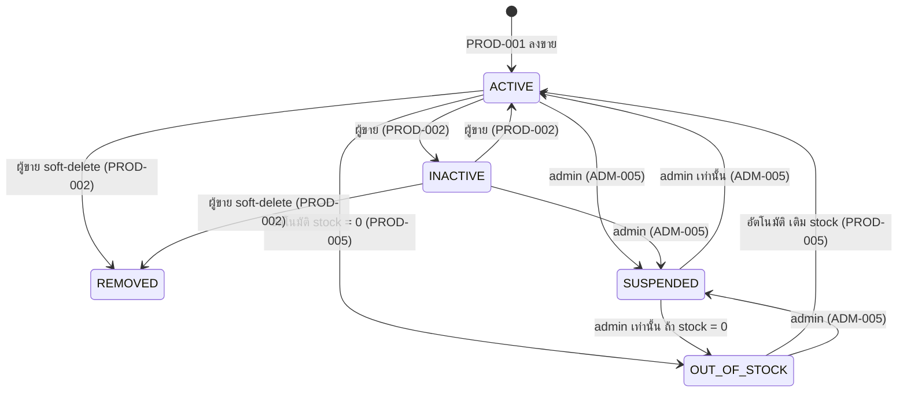

# ADR-0002 — ใช้สถานะ `SUSPENDED` แยกการปิดการขายโดย Admin ออกจากการปิดโดยผู้ขาย

- **สถานะ:** Accepted
- **วันที่:** 2026-08-19
- **อ้างอิง:** SRS v4 ADM-005, PROD-002, PROD-003, PROD-005
- **เกี่ยวข้องกับ:** Dev 3 (ADM-005, PROD-002, PROD-003, PROD-005), Dev 2 (เจ้าของ schema/migration)
- **สืบเนื่องจาก:** [ADR-0001](0001-single-admin-role-and-shared-category-set.md) หัวข้อประเด็นค้าง

---

## บริบท

SRS มีข้อกำหนด 2 ข้อที่ทับซ้อนกัน:

- **ADM-005** — "Admin ปิดหรือเปิดการขายสินค้าที่ไม่เหมาะสมกลับคืนได้ พร้อมบันทึกเหตุผลไว้ทุกครั้ง ... การปิดการขายจะปิดกั้นคำสั่งซื้อใหม่ แต่ไม่ยกเลิกคำสั่งซื้อที่จ่ายเงินแล้ว (PAID)"
- **PROD-002** — "ผู้ขายแก้ไขราคา, รายละเอียด, รูปภาพ, หมวดหมู่ และสต็อกได้ในขณะที่สินค้าอยู่ในสถานะ ACTIVE หรือ INACTIVE"

`ProductStatus` เดิมมี `ACTIVE / INACTIVE / OUT_OF_STOCK / REMOVED` ซึ่ง **แยกไม่ออกว่า `INACTIVE` นั้นเกิดจากผู้ขายปิดเอง หรือ admin สั่งปิด** ผลคือผู้ขายกด `ACTIVE` กลับได้ทันทีหลัง admin สั่งปิด ทำให้ ADM-005 ไม่มีผลบังคับจริง

SRS ไม่ได้ระบุทางออกไว้ ทีมจึงตัดสินใจกันเองว่า **ถ้า admin เป็นคนสั่งปิด ผู้ขายต้องเปิดกลับเองไม่ได้**

---

## การตัดสินใจ

เพิ่มค่า `SUSPENDED` เข้า `enum ProductStatus` แล้วให้ "ใครเป็นคนปิด" เป็นส่วนหนึ่งของ state machine โดยตรง

```prisma
enum ProductStatus {
  ACTIVE
  INACTIVE
  OUT_OF_STOCK
  REMOVED
  SUSPENDED // ADM-005 — admin สั่งปิดเท่านั้น ผู้ขายเปลี่ยนออกเองไม่ได้ (PROD-002)
}
```

migration: `20260819031110_add_suspended_product_status` (`ALTER TYPE "ProductStatus" ADD VALUE 'SUSPENDED'` บรรทัดเดียว ไม่มีคอลัมน์ใหม่ ไม่ต้อง backfill)

ไม่เพิ่มค่าใน `AdminActionType` — `DEACTIVATE_PRODUCT` / `REACTIVATE_PRODUCT` ที่มีอยู่แล้วใช้ได้ตรงความหมาย

---

## State machine



**`SUSPENDED` เป็นสถานะปลายทางสำหรับผู้ขาย** — ผู้ขายย้ายออกจากสถานะนี้ไม่ได้เลย รวมถึงย้ายไป `REMOVED` ด้วย

เหตุผลที่ต้องกันทาง `REMOVED` ด้วย ไม่ใช่เพราะมีฟีเจอร์กู้คืน (V1 ไม่มี — ดูหัวข้อถัดไป) แต่เพราะ **การย้ายไป `REMOVED` จะลบร่องรอยว่าสินค้าเคยถูกระงับ** เนื่องจาก `SUSPENDED` เก็บอยู่ใน field เดียวกับที่ผู้ขายเขียนได้ ถ้า guard เขียนแบบเช็คสถานะปลายทาง (`ถ้ากำลังจะเป็น ACTIVE และตอนนี้เป็น SUSPENDED → ปฏิเสธ`) ผู้ขายจะเดินอ้อม 2 ก้าวคือ `SUSPENDED → REMOVED → ACTIVE` ได้ทันที เพราะก้าวที่สอง guard ไม่ทำงานแล้ว

**guard ต้องเช็คที่สถานะปัจจุบัน ไม่ใช่สถานะปลายทาง:**

```ts
// ✅ ถูก — บล็อกทุกการกระทำของผู้ขายเมื่อสินค้าอยู่ในสถานะ SUSPENDED
if (product.status === ProductStatus.SUSPENDED) {
  throw new ForbiddenException('สินค้านี้ถูกระงับโดยผู้ดูแลระบบ');
}
```

---

## `REMOVED` เป็นสถานะปลายทาง ไม่มีการกู้คืนใน V1

ทีมตัดสินใจว่า **V1 ไม่ทำฟีเจอร์กู้คืนสินค้าที่ถูกลบ** — ไม่มี endpoint `restore` และไม่มีเส้นทางออกจาก `REMOVED` ในทุกกรณี (ตรงกับ state machine ด้านบนที่ไม่มีลูกศรออกจาก `REMOVED`)

เหตุผลไม่ใช่แค่ประหยัดเวลา แต่เพราะ **SRS มีทางออกให้อยู่แล้ว**:

| ความต้องการของผู้ขาย | สถานะที่ถูกต้อง | กลับมาขายได้ไหม |
| --- | --- | --- |
| พักขายชั่วคราว / ของหมด / ยังไม่พร้อม | `INACTIVE` | ได้ ผู้ขายกดเองได้ตลอด |
| ไม่ต้องการรายการนี้อีกแล้ว | `REMOVED` | ไม่ได้ ต้องลงขายใหม่ |

ถ้าเพิ่มปุ่มกู้คืน `REMOVED` จะกลายเป็น `INACTIVE` ที่ซ้ำซ้อน — มีสองสถานะทำงานเหมือนกัน แล้วผู้ขายจะสับสนว่าควรใช้อันไหน

**สิ่งที่ต้องทำแทน (งาน UI ล้วน — Dev 1 / Dev 3):**

- ปุ่มลบต้องมี confirm dialog ที่เขียนชัดว่า **"ลบแล้วกู้คืนไม่ได้"**
- ใน dialog เดียวกันต้องเสนอทางเลือกว่า *"ถ้าแค่อยากหยุดขายชั่วคราว ให้ใช้ปิดการขาย (INACTIVE) แทน"*
- ปุ่ม "ปิดการขาย" ควรเด่นกว่าปุ่ม "ลบ" ในหน้าจัดการสินค้า

ผู้ขายที่ลบไปแล้วต้องลงขายใหม่ทั้งหมด — ได้ `product.id` ใหม่, ต้องอัปโหลดรูปใหม่ (`product_images` ผูกกับ id เดิม), ลิงก์เดิมที่แชร์ไว้ตาย 404 และแชทเดิมที่ผูกกับ `product_id` เดิมเริ่ม thread ใหม่ ส่วนประวัติคำสั่งซื้อเก่าไม่หาย เพราะเป็น soft-delete

> **หมายเหตุถ้าอนาคตจะเพิ่ม restore:** ทำได้ปลอดภัยโดยไม่ต้องแก้ schema (`PATCH /products/:id/restore` คืนไป `INACTIVE` ไม่ใช่ `ACTIVE`) — แต่ปลอดภัยได้ **ก็ต่อเมื่อ guard บล็อก `SUSPENDED → REMOVED` ตามหัวข้อด้านบนแล้วเท่านั้น** ไม่งั้นจะเปิดช่องเลี่ยงการระงับทันที

---

## กฎที่ต้อง implement (Dev 3)

| จุด | กฎ |
| --- | --- |
| ADM-005 admin ปิด | `status = SUSPENDED` + เขียน `admin_actions` (`DEACTIVATE_PRODUCT`) ใน `$transaction` เดียวกัน ตาม ADR-0001 |
| ADM-005 admin เปิดกลับ | `status = stockQty > 0 ? ACTIVE : OUT_OF_STOCK` + เขียน `admin_actions` (`REACTIVATE_PRODUCT`) ใน transaction เดียวกัน |
| PROD-002 ผู้ขายเปลี่ยนสถานะ | ถ้าสถานะปัจจุบันเป็น `SUSPENDED` → ตอบ `403 Forbidden` พร้อมข้อความว่าถูกระงับโดยผู้ดูแลระบบ |
| PROD-002 ผู้ขายแก้ข้อมูลสินค้า | สินค้าที่ `SUSPENDED` แก้ไขไม่ได้ — PROD-002 อนุญาตแก้เฉพาะ `ACTIVE`/`INACTIVE` อยู่แล้ว |
| PROD-002 ผู้ขาย soft-delete | สินค้าที่ `SUSPENDED` ลบไม่ได้ด้วย เพื่อไม่ให้ลบร่องรอยการระงับ |
| PROD-002 กู้คืนสินค้าที่ลบแล้ว | ไม่มีใน V1 — `REMOVED` เป็นสถานะปลายทาง ต้องมี confirm dialog ที่บอกว่ากู้คืนไม่ได้ และเสนอ `INACTIVE` เป็นทางเลือก |
| PROD-005 auto-flip | ต้องข้ามสินค้าที่ `SUSPENDED` ไม่งั้นการเติม stock จะเปลี่ยนกลับเป็น `ACTIVE` เอง แล้วลบล้างคำสั่ง admin |
| PROD-003 / PROD-004 หน้าสาธารณะ | กรอง `status = ACTIVE` อยู่แล้ว → `SUSPENDED` ถูกซ่อนอัตโนมัติ ไม่ต้องแก้ query |
| หน้ารายการสินค้าของผู้ขาย | ต้องแสดง `SUSPENDED` พร้อมป้ายบอกให้ชัด เพื่อให้ผู้ขายรู้ว่าทำไมแก้ไม่ได้ ไม่ใช่ซ่อนหายไปเฉยๆ |
| CART / checkout | สินค้าที่ `SUSPENDED` ต้องเพิ่มลงตะกร้าและ checkout ไม่ได้ (ADM-005 "ปิดกั้นคำสั่งซื้อใหม่") |
| Order ที่มีอยู่แล้ว | ห้ามแตะ `orders` ที่ `PAID` เด็ดขาด ตาม ADM-005 |

⚠️ **จุดที่พลาดง่ายที่สุดคือ PROD-005 auto-flip** — ถ้าลืมกัน สินค้าที่ admin สั่งระงับจะกลับมาขายเองเงียบๆ ตอนผู้ขายเติม stock

---

## เหตุผลที่เลือกวิธีนี้

- **แหล่งข้อมูลเดียว** — สถานะการมองเห็นของสินค้าอยู่ที่ `status` field เดียว ไม่ต้องเซ็ต 2 field ให้ตรงกัน
- **หน้าสาธารณะไม่ต้องแก้** — ทุก query ที่กรอง `status = ACTIVE` ซ่อน `SUSPENDED` ให้อัตโนมัติตั้งแต่วันแรก
- **migration เบา** — เพิ่มค่า enum อย่างเดียว ไม่มีคอลัมน์ใหม่ ไม่ต้อง backfill ข้อมูลเดิม
- **อ่านโค้ดแล้วเข้าใจทันที** — `if (product.status === SUSPENDED) throw Forbidden(...)` ชัดกว่าการเช็ค flag แยกหรือ query audit log

---

## ทางเลือกที่พิจารณาแล้วไม่เลือก

| ทางเลือก | เหตุผลที่ไม่เลือก |
| --- | --- |
| เพิ่มคอลัมน์ `Product.adminDeactivatedAt DateTime?` | ต้องเซ็ต 2 field พร้อมกัน (`status = INACTIVE` + `adminDeactivatedAt = now`) และเคลียร์ 2 field ตอนปลด เสี่ยงหลุด sync ข้อดีคือ PROD-005 auto-flip ไม่ต้องแก้ แต่แลกมาด้วยความซับซ้อนที่มากกว่า |
| อ่านสถานะจาก `admin_actions` แถวล่าสุด | ไม่ต้องเพิ่ม field ใน `Product` แต่ยังต้องแก้ schema อยู่ดีเพื่อเพิ่ม `@@index([productId, createdAt])` และเพิ่ม query 1 ครั้งทุกการเปลี่ยนสถานะ ที่สำคัญคือ audit log ควรเป็นบันทึกแบบ append-only ว่า "เกิดอะไรขึ้น" ไม่ใช่ source of truth ของ state ปัจจุบัน |
| ปล่อยตาม SRS เดิม (ไม่แก้อะไร) | ADM-005 จะไม่มีผลบังคับจริง เพราะผู้ขายกด `ACTIVE` กลับได้ทันที |

---

## ผลที่ตามมา

**ข้อดี**

- ADM-005 บังคับใช้ได้จริงที่ระดับ state machine ไม่ใช่แค่ที่ UI (สอดคล้อง SRS §6 ที่บังคับให้ตรวจสิทธิ์ฝั่ง server)
- แยก "ผู้ขายปิดเอง" กับ "admin สั่งปิด" ออกจากกันได้ในรายงานและหน้า audit

**ข้อเสียที่ยอมรับ**

- ทุกที่ที่ `switch` หรือ map `ProductStatus` ต้องเพิ่มเคส `SUSPENDED` — TypeScript จะเตือนให้เองถ้าเขียน exhaustive check
- PROD-005 auto-flip ต้องเพิ่มเงื่อนไขกัน 1 บรรทัด (ระบุไว้ในตารางด้านบนแล้ว)
- ยังไม่ได้เก็บ "เหตุผลที่ระงับ" ไว้บนแถว `Product` — เหตุผลอยู่ใน `admin_actions.note` ตาม ADM-005 ถ้าหน้าจอผู้ขายต้องแสดงเหตุผลให้เจ้าของสินค้าเห็น ต้อง join กลับไปที่ `admin_actions` ให้เสนอทีมก่อนถ้าจะเพิ่ม field
